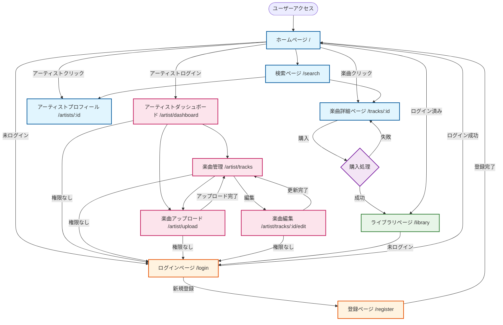
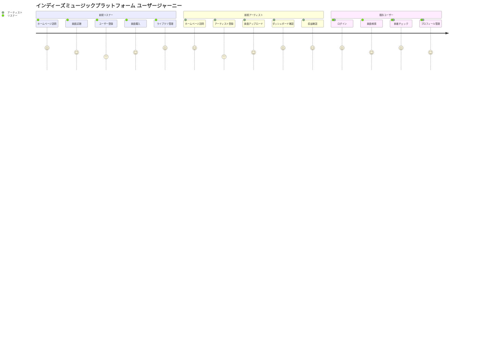
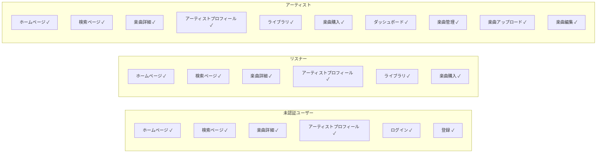

# インディーズミュージックプラットフォーム - 機能仕様書

## プロジェクト概要

インディーズミュージシャンが楽曲を直接販売・配信できるプラットフォーム。
レコードレーベルを介さずに音楽活動を収益化することを目的とした音楽プラットフォームです。

## アーキテクチャ概要

### バックエンド

- **技術スタック**: FastAPI + PostgreSQL + SQLAlchemy
- **認証**: Firebase Authentication
- **ストレージ**: AWS S3 (音楽ファイル・画像)
- **決済**: Stripe
- **デプロイ**: Azure Container Apps

### フロントエンド

- **技術スタック**: React + Vite + React Router
- **状態管理**: Context API (AuthContext, PlayerContext)
- **スタイリング**: styled-components
- **デプロイ**: Azure Static Web Apps

## ユーザー種別

### 1. リスナー (Listener)

- 楽曲の検索・試聴・購入
- 個人ライブラリの管理
- アーティストのフォロー

### 2. アーティスト (Artist)

- 楽曲のアップロード・管理
- 売上統計の確認
- プロフィール管理

### 3. 管理者 (Admin)

- プラットフォーム全体の管理
- ユーザー管理

## データベース設計

### User (ユーザー)

```sql
- id: String (Primary Key)
- email: String (Unique)
- firebase_uid: String (Unique)
- display_name: String
- profile_image: String (Optional)
- user_role: Enum (artist/listener/admin)
- is_verified: Boolean
- created_at: DateTime
- updated_at: DateTime
```

### Track (楽曲)

```sql
- id: String (Primary Key)
- artist_id: String (Foreign Key → User.id)
- title: String
- description: Text
- genre: String
- cover_art_url: String
- audio_file_url: String
- duration: Integer (秒)
- price: Decimal
- release_date: Date
- is_public: Boolean
- play_count: Integer
- created_at: DateTime
- updated_at: DateTime
```

### Purchase (購入履歴)

```sql
- id: String (Primary Key)
- user_id: String (Foreign Key → User.id)
- track_id: String (Foreign Key → Track.id)
- amount: Decimal
- payment_method: Enum
- transaction_id: String
- status: Enum
- purchase_date: DateTime
```

### PlayHistory (再生履歴)

```sql
- id: String (Primary Key)
- user_id: String (Foreign Key → User.id)
- track_id: String (Foreign Key → Track.id)
- played_at: DateTime
```

## API エンドポイント

### 認証 (`/api/v1/auth/`)

- `POST /register` - ユーザー登録
- `GET /me` - 現在のユーザー情報取得
- `PUT /me` - ユーザー情報更新

### 楽曲 (`/api/v1/tracks/`)

- `GET /` - 楽曲一覧取得 (検索・フィルタ・ソート対応)
- `GET /{track_id}` - 楽曲詳細取得
- `POST /` - 楽曲作成 (アーティストのみ)
- `PUT /{track_id}` - 楽曲更新 (アーティストのみ)
- `DELETE /{track_id}` - 楽曲削除 (アーティストのみ)
- `POST /upload/audio` - 音声ファイルアップロード
- `POST /upload/cover` - カバーアートアップロード

### ユーザー (`/api/v1/users/`)

- `GET /{user_id}` - ユーザープロフィール取得
- `GET /{user_id}/tracks` - ユーザーの楽曲一覧

### 購入 (`/api/v1/purchases/`)

- `POST /` - 楽曲購入
- `GET /` - 購入履歴取得
- `GET /{track_id}/status` - 購入状況確認

### ストリーミング (`/api/v1/stream/`)

- `GET /{track_id}` - 楽曲ストリーミングURL取得
- `POST /{track_id}/play` - 再生回数記録

## フロントエンド画面遷移

### 画面遷移図



### ユーザージャーニー図



### ページ権限マトリックス



### 共通ページ

1. **ホームページ** (`/`)
   - 新着楽曲一覧 (8件表示)
   - おすすめアーティスト (5件表示)
   - 楽曲プレビュー再生機能
   - 楽曲購入ボタン

2. **検索ページ** (`/search`)
   - 楽曲・アーティスト検索
   - ジャンルフィルタ
   - 価格帯フィルタ
   - ソート機能 (新着・人気・価格)

3. **楽曲詳細ページ** (`/tracks/{trackId}`)
   - 楽曲情報表示
   - アーティスト情報
   - 試聴機能
   - 購入・ダウンロード機能
   - 関連楽曲表示

4. **アーティストプロフィール** (`/artists/{artistId}`)
   - アーティスト基本情報
   - 公開楽曲一覧
   - フォロー機能

### 認証ページ

5. **ログインページ** (`/login`)
   - メールアドレス・パスワード入力
   - Firebase Authentication連携
   - モック認証対応 (開発用)

6. **登録ページ** (`/register`)
   - 新規ユーザー登録
   - 表示名・メールアドレス・パスワード
   - ユーザー種別選択 (リスナー/アーティスト)

### リスナー向けページ

7. **ライブラリページ** (`/library`)
   - 購入済み楽曲一覧
   - ダウンロード履歴
   - お気に入り楽曲

### アーティスト向けページ

8. **アーティストダッシュボード** (`/artist/dashboard`)
   - 統計情報 (総再生回数・収益・楽曲数)
   - 楽曲管理テーブル
   - サイドバーナビゲーション

9. **楽曲管理ページ** (`/artist/tracks`)
   - アップロード済み楽曲一覧
   - 公開/非公開切り替え
   - 楽曲編集・削除

10. **楽曲アップロードページ** (`/artist/upload`)
    - 楽曲ファイルアップロード
    - カバーアートアップロード
    - メタデータ入力 (タイトル・説明・ジャンル・価格)

11. **楽曲編集ページ** (`/artist/tracks/{trackId}/edit`)
    - 楽曲情報編集
    - カバーアート変更
    - 公開設定変更

## 主要機能詳細

### 1. 楽曲ストリーミング・購入システム

- **試聴機能**: 30秒プレビュー
- **購入フロー**: Stripe決済連携
- **ダウンロード**: 購入後の楽曲ダウンロード
- **プレイヤー**: 底部固定プレイヤー
- **プレイリスト**: 楽曲リスト再生

### 2. アーティスト収益システム

- **収益率**: プラットフォーム手数料15%
- **統計表示**: 再生回数・収益・トレンド
- **支払い**: 月次収益レポート

### 3. ファイル管理システム

- **音声ファイル**: MP3, WAV, FLAC, AAC, M4A対応
- **画像ファイル**: JPG, PNG対応
- **ストレージ**: AWS S3
- **CDN**: 高速配信

### 4. 検索・フィルタリング

- **全文検索**: 楽曲タイトル・アーティスト名・ジャンル
- **フィルタ**: ジャンル・価格帯・リリース日
- **ソート**: 新着・人気・価格・アーティスト名

## セキュリティ・認証

### Firebase Authentication

- **認証方法**: メール・パスワード
- **JWT トークン**: API認証
- **権限管理**: ロールベースアクセス制御

### API セキュリティ

- **CORS設定**: 許可ドメイン制限
- **レート制限**: IP・ユーザー別制限
- **入力検証**: Pydanticスキーマ
- **ファイルアップロード**: サイズ・形式制限

## 開発・デプロイ環境

### 開発環境

- **フロントエンド**: `http://localhost:5175`
- **バックエンド**: `http://127.0.0.1:8004`
- **モック認証**: 開発用認証バイパス

### 本番環境

- **ドメイン**: `musicshelf.net`
- **フロントエンド**: Azure Static Web Apps
- **バックエンド**: `api.musicshelf.net` (Azure Container Apps)
- **データベース**: PostgreSQL
- **SSL**: 自動発行・更新

## 今後の拡張予定

### フェーズ2機能

- **プレイリスト機能**: ユーザー作成プレイリスト
- **フォロー機能**: アーティスト・リスナーフォロー
- **コメント・レビュー**: 楽曲評価システム
- **ライブ配信**: リアルタイム配信機能

### フェーズ3機能

- **コラボレーション**: アーティスト間コラボ
- **チケット販売**: ライブイベント連携
- **NFT統合**: 楽曲NFT販売
- **AI推薦**: パーソナライズ推薦システム

## 技術的な特徴

### パフォーマンス最適化

- **画像最適化**: WebP対応
- **遅延読み込み**: 楽曲リスト
- **キャッシュ戦略**: CDN・ブラウザキャッシュ
- **データベース**: インデックス最適化

### 可用性・スケーラビリティ

- **Azure Container Apps**: 自動スケーリング
- **ヘルスチェック**: 自動復旧
- **ログ監視**: 構造化ログ
- **バックアップ**: 自動データベースバックアップ

## 運用・監視

### ログ管理

- **構造化ログ**: JSON形式
- **ビジネスイベント**: ユーザー行動追跡
- **エラー監視**: 例外処理・通知
- **パフォーマンス**: レスポンス時間監視

### 分析・KPI

- **ユーザー分析**: 登録・アクティブユーザー
- **楽曲分析**: 再生回数・売上
- **収益分析**: プラットフォーム手数料
- **A/Bテスト**: 機能改善
