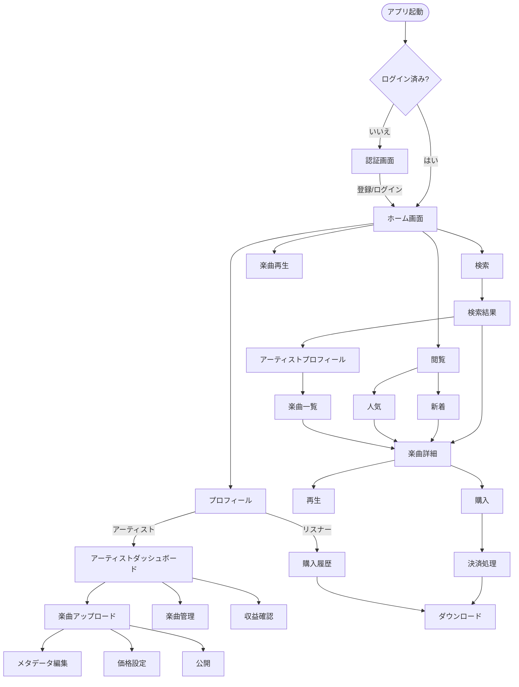
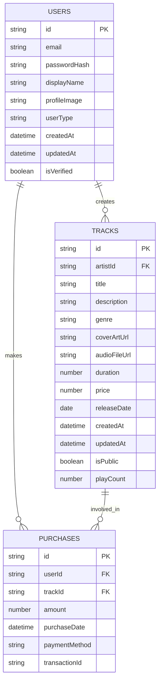

# 🎵 Indie Music Platform - Frontend

独立系アーティスト向け音楽プラットフォームのReactフロントエンド

## 🚀 技術スタック

- **React 18** - モダンWebアプリケーション
- **Vite** - 高速ビルドツール
- **React Router** - SPA ルーティング
- **Styled Components** - CSS-in-JS スタイリング
- **Chart.js** - データ可視化
- **Howler.js** - 音声再生ライブラリ
- **Firebase** - 認証システム
- **Vitest** - 単体テスト
- **Playwright** - E2Eテスト

## 📦 インストール・起動

```bash
# 依存関係インストール
npm install

# 開発サーバー起動
npm run dev

# プロダクションビルド
npm run build

# プレビュー
npm run preview
```

## 🧪 テスト

```bash
# 単体テスト実行
npm test

# テスト（ウォッチモード）
npm run test:watch

# E2Eテスト実行
npm run test:e2e

# E2Eテスト（UIモード）
npm run test:e2e:ui
```

## 🏗️ プロジェクト構造

```
src/
├── components/           # 再利用可能コンポーネント
│   ├── analytics/       # 分析・グラフコンポーネント
│   ├── common/          # 共通コンポーネント
│   ├── layout/          # レイアウトコンポーネント
│   ├── payment/         # 決済関連コンポーネント
│   └── player/          # 音楽プレイヤーコンポーネント
├── pages/               # ページコンポーネント
│   ├── artist/          # アーティスト向けページ
│   ├── auth/            # 認証ページ
│   ├── common/          # 共通ページ
│   └── listener/        # リスナー向けページ
├── contexts/            # React Context
├── hooks/               # カスタムフック
├── services/            # API通信
├── utils/               # ユーティリティ関数
└── __tests__/           # テストファイル
```

## ⚡ パフォーマンス最適化

### バンドル分割
- **vendor**: React, React DOM
- **router**: React Router DOM
- **icons**: React Icons
- **styled**: Styled Components
- **player**: Howler.js
- **charts**: Chart.js, React-Chartjs-2

### 最適化機能
- APIレスポンスキャッシュ（5分間）
- 遅延ローディング
- 画像最適化
- Tree shaking

## 🎨 UI/UX機能

### レスポンシブデザイン
- モバイルファースト設計
- タブレット・デスクトップ対応
- 適応的レイアウト

### ローディング状態
- スケルトンローダー
- ローディングスピナー
- プログレッシブローディング

### アクセシビリティ
- キーボードナビゲーション
- スクリーンリーダー対応
- 適切なカラーコントラスト

## 🎵 音楽プレイヤー機能

### 基本機能
- 高品質音声再生（Howler.js）
- 再生・一時停止・スキップ
- 音量調整・シーク機能

### 高度な機能
- シャッフル再生
- リピート機能（1曲/全曲/なし）
- プレイリスト管理
- 再生履歴
- 楽曲終了時自動次曲再生

## 📊 アナリティクス機能

### 売上分析
- 収益推移グラフ（線・棒グラフ）
- 期間別比較（7日・30日・90日）
- 収益内訳（ドーナツチャート）

### 楽曲統計
- 再生・ダウンロード・いいね・シェア数
- ソート・フィルター機能
- 楽曲別パフォーマンス分析

## 🔒 セキュリティ機能

### 入力検証
- クライアントサイド検証
- サニタイゼーション
- XSS対策

### 認証・認可
- Firebase Authentication
- JWT トークン管理
- ロールベースアクセス制御

## 🛠️ 開発ツール

### リンティング・フォーマット
```bash
npm run lint          # ESLint実行
npm run lint:fix      # ESLint自動修正
```

### 型チェック
- TypeScript（部分的導入）
- PropTypes（Reactコンポーネント）

## 🌍 環境設定

### 環境変数（.env）
```env
VITE_API_BASE_URL=http://localhost:8000/api/v1
VITE_FIREBASE_API_KEY=your-firebase-api-key
VITE_FIREBASE_AUTH_DOMAIN=your-project.firebaseapp.com
VITE_FIREBASE_PROJECT_ID=your-project-id
VITE_STRIPE_PUBLISHABLE_KEY=pk_test_your-stripe-key
```

### ビルド設定
- チャンク分割によるロード時間短縮
- Tree shaking による不要コード除去
- CSS最適化・圧縮

## 📱 PWA対応

### 今後の実装予定
- サービスワーカー
- オフライン再生
- プッシュ通知
- インストール可能化

## 🧪 テスト戦略

### 単体テスト
- コンポーネントテスト
- カスタムフックテスト
- ユーティリティ関数テスト
- 35個のテスト（全通過）

### E2Eテスト
- ユーザージャーニーテスト
- 音楽プレイヤー機能テスト
- 決済フローテスト
- ファイルアップロードテスト

## 🚀 デプロイ

### 本番ビルド
```bash
npm run build
# dist/ フォルダが生成される
```

### Azure Static Web Apps
- 自動デプロイ（GitHub Actions）
- カスタムドメイン対応
- SSL証明書自動取得

## 🔧 トラブルシューティング

### よくある問題

1. **ビルドエラー**
   ```bash
   rm -rf node_modules package-lock.json
   npm install
   ```

2. **型エラー**
   - TypeScript設定確認
   - 型定義ファイル更新

3. **パフォーマンス問題**
   - React DevTools Profiler使用
   - バンドルアナライザー確認

### デバッグツール
- React Developer Tools
- Redux DevTools（状態管理時）
- Network tab（API確認）

---

## 原設計資料

### UserFlow



### Database Design



---

**🎵 高品質な音楽体験を提供するモダンWebアプリケーション 🎵**